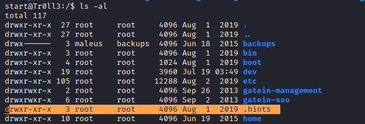
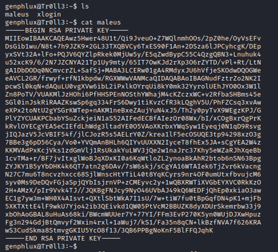
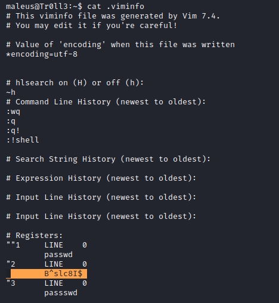
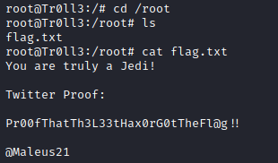

```
IP=192.168.56.101
```

## start:here 
Let's start by scanning all open ports and their versions.


Since no other open port is found, let's just directly jump into ssh with the credentials provided.



If we navigate to the root directory, we find an interesting directory called `.hints`. In here, there's a lot of nested folder. We can just list all of them recursively to reach to the end. 


We find a text file containing a lot of, what it seems to be gibberish. We can maybe find similar files by searching them with the same permission.


Found a `.cap` file. Let's transfer it to our host machine and inspect it with wireshark.


The file seems to be a deauth packet. 


We could try to crack the password using `aircrack-ng` and the previous `.txt` file as dictionary.


## wytshadow:gaUoCe34t1
We found an executable in the home directory that when inspected using `strings`, revealed that it just run a `.sh` file.


Apparently all it does is outputting a message in an infinite loop. Let's check `sudo -l`.


Our limited root privilege seemed to only allowed us to start nginx.


After starting nginx, If we tried to access the webserver using `lynx` as indicated before, it would reveal another credential.

## genphlux:HF9nd0cR!



`xlogin` is just a regular html file, nothing's interesting. `maleus` however, contains a private key.


An error like this can easily be solved by changing the key permission to 600.


There, we're inside maleus.

## maleus
A quick look at the home directory doesn't reveal a lot of information nor anything interesting. We can try to use `sudo -l` but we don't have this user's password, or do we?



Looking at commands history through `.viminfo` we find an interesting looking string that could be a possible password.


Confirming it using `sudo -l` and it IS the password. 
We have permission to run an executable called `dont_even_bother` as `sudo`. Now we can just write a C code that turn us into the root user and spawn a shell.


Compiling the code above and running the executable as sudo turn us into the root user. 

